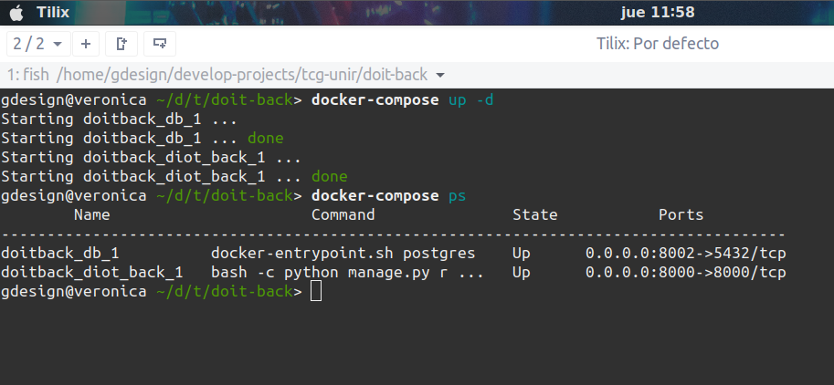

# TFG UNIR Carlos Velasco
## Aplicación Api Diot Backend en Django

Esta aplicación es parte del proyecto Diot Alarma Inteligente.


## Requisitos
* Docker
* Docker Compose

## Instalación
La aplicación se despliega con dockers por lo que ejecutaremos los comandos de docker-compose para construir y correr la aplicación en modo de desarrollo.

```bat
docker-compose build
docker-compose up -d
```

Para revisar que los dockers estén funcionando ejecutamos:

```bat
docker-compose ps
```




